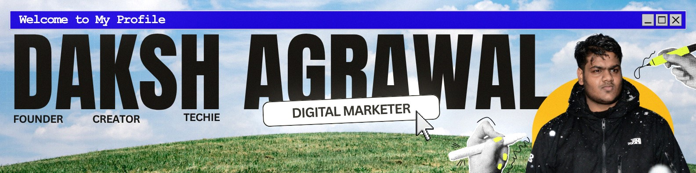

Daksh — "skilled, capable." My parents named me that before I had to earn it. Still working on it.

I run Uideas — video editing, motion graphics, brand identity, and web dev, mostly for creators and small brands who need content that doesn't look like everyone else's. No team behind me, so I've picked up scripting, production pipelines, and enough code to build the tools an agency my size usually can't afford. Grew [@uideasofficial](https://instagram.com/uideasofficial) to 50K+ followers doing exactly this.

This GitHub is the other half — where the "backend" work lives. I'm not a trained engineer, I learn by breaking things until they work, then breaking them again on purpose to see why. Most of what's here started as "I needed this for the studio and didn't want to depend on someone else's cloud tool for it." Local-first by default, not because I'm dogmatic about it, but because it's usually the harder and more interesting way to build something.

If you're into either side of this — the content or the tools — that's the kind of work I actually enjoy.

---

### Now

Shipping [Dictator](https://github.com/IntellectDaksh/Dictator) v1, next up is figuring out what breaks in it.
Updated 2026-07-22 — I'll forget to update this, call it out if it goes stale.

### Pinned

<a href="https://github.com/IntellectDaksh/Dictator">
<picture>
  <source media="(prefers-color-scheme: dark)" srcset="https://github-readme-stats.vercel.app/api/pin/?username=IntellectDaksh&repo=Dictator&theme=tokyonight&hide_border=true" />
  <source media="(prefers-color-scheme: light)" srcset="https://github-readme-stats.vercel.app/api/pin/?username=IntellectDaksh&repo=Dictator&theme=default&hide_border=true" />
  
</picture>
</a>

### GitHub activity

<picture>
  <source media="(prefers-color-scheme: dark)" srcset="https://raw.githubusercontent.com/IntellectDaksh/IntellectDaksh/output/stats-dark.svg" />
  <source media="(prefers-color-scheme: light)" srcset="https://raw.githubusercontent.com/IntellectDaksh/IntellectDaksh/output/stats-light.svg" />
  
</picture>

Custom-built card, not a stitched-together badge stack — see <a href="./.github/scripts/gen-stats.mjs">gen-stats.mjs</a>. Refreshes every 6h. <a href="https://wakatime.com/@IntellectDaksh">wakatime.com/@IntellectDaksh</a> once the plugin's tracked a week.

### Contribution snake

<picture>
  <source media="(prefers-color-scheme: dark)" srcset="https://raw.githubusercontent.com/IntellectDaksh/IntellectDaksh/output/snake-dark.svg" />
  <source media="(prefers-color-scheme: light)" srcset="https://raw.githubusercontent.com/IntellectDaksh/IntellectDaksh/output/snake-light.svg" />
  
</picture>

Generated every 6h by <a href="./.github/workflows/snake.yml">.github/workflows/snake.yml</a> — first render appears after it runs once.
